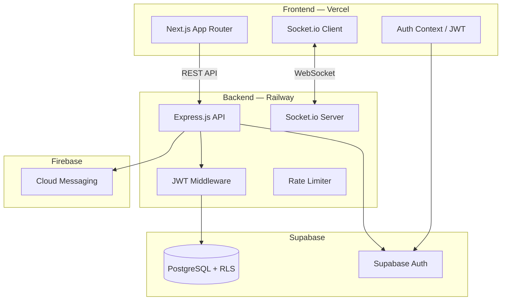

<div align="center">


# HRMS — Human Resource Management System

**A production-ready, full-stack workforce platform built for modern teams.**

[](https://hrms-system-ochre.vercel.app)
[](https://hrms-system-production-572f.up.railway.app/health)

---


</div>

---

## Overview

HRMS is a full-featured Human Resource Management System with role-based dashboards for **Admins**, **Managers**, and **Employees**. Built on a Next.js frontend and Express.js API, it uses Supabase for the database and auth, Socket.io for real-time features, and Firebase for push notifications.

---

## Architecture



---

## Tech Stack

| Layer | Technology |
|---|---|
| Frontend | Next.js 16 (App Router), Tailwind CSS |
| Backend | Node.js 18+, Express.js |
| Database | Supabase (PostgreSQL + Row Level Security) |
| Auth | Supabase Auth (JWT) |
| Realtime | Socket.io |
| Push Notifications | Firebase Cloud Messaging |
| Deployment | Vercel (frontend) + Railway (backend) |

---

## Features

### Employee Portal
| Feature | Description |
|---|---|
| Punch In / Out | Live timer with real-time attendance tracking |
| Attendance Calendar | Monthly summary with daily status |
| Task Management | Create, update, and complete personal tasks |
| Project Chat | Real-time messaging per project via Socket.io |
| Leave Requests | Apply for leave with balance tracking |
| Payslip Viewer | View and download monthly payslips |
| EOD Updates | Daily end-of-day updates with mood selector |
| Push Notifications | Browser push via Firebase Cloud Messaging |
| Profile | Avatar upload and profile management |

### Manager Portal
| Feature | Description |
|---|---|
| Team Dashboard | Live attendance feed for the entire team |
| Leave Approvals | Approve or reject with comments |
| Team Overview | Member details and task assignment |

### Admin Portal
| Feature | Description |
|---|---|
| Org Dashboard | Company-wide stats and KPIs |
| Employee Directory | Onboard, activate, deactivate employees |
| Payroll | Create and bulk-publish payslips |
| Reports | Attendance, payroll, and task reports with charts |
| Shift Management | Create and assign shift schedules |
| Announcements | Broadcast announcements to all staff |

---

## Demo Credentials

> Try the live app at [hrms-system-ochre.vercel.app](https://hrms-system-ochre.vercel.app)

| Role | Email | Password |
|---|---|---|
| Admin | admin@hrms.com | HrmsPass@2025 |
| Manager | manager1@hrms.com | HrmsPass@2025 |
| Employee | employee1@hrms.com | HrmsPass@2025 |

---

## Project Structure

```
HRMS-System/
├── supabase/
│   └── migrations/              # Run these in order in Supabase SQL Editor
│       ├── 001_create_tables.sql
│       ├── 002_rls_policies.sql
│       ├── 003_seed_data.sql
│       └── 004_add_announcements.sql
├── hrms-backend/                # Express.js API (deploy root on Railway)
│   ├── controllers/
│   ├── middleware/
│   ├── routes/
│   ├── socket/
│   ├── utils/
│   ├── server.js
│   ├── .env.example
│   └── railway.json
└── hrms-frontend/               # Next.js app (deploy root on Vercel)
    ├── app/
    ├── components/
    ├── context/
    ├── hooks/
    ├── lib/
    ├── utils/
    ├── .env.example
    └── vercel.json
```

---

## Local Development

### Prerequisites
- Node.js 18+
- A [Supabase](https://supabase.com) project

### 1. Clone

```bash
git clone https://github.com/Ritikraja07/HRMS-System.git
cd HRMS-System
```

### 2. Supabase Setup

1. Create a new Supabase project
2. Open **SQL Editor** and run migrations **in order**:
   ```
   supabase/migrations/001_create_tables.sql
   supabase/migrations/002_rls_policies.sql
   supabase/migrations/003_seed_data.sql
   supabase/migrations/004_add_announcements.sql
   ```
3. Enable **Email** auth — Authentication → Providers
4. From **Settings → API**, copy: Project URL, Anon Key, Service Role Key, JWT Secret

### 3. Backend

```bash
cd hrms-backend
cp .env.example .env
npm install
npm run dev        # → http://localhost:4000
```

| Variable | Value |
|---|---|
| `PORT` | `4000` |
| `NODE_ENV` | `development` |
| `SUPABASE_URL` | Supabase → Settings → API |
| `SUPABASE_SERVICE_ROLE_KEY` | Supabase → Settings → API |
| `JWT_SECRET` | Supabase → Settings → API → JWT Settings |
| `CORS_ORIGIN` | `http://localhost:3000` |
| `FIREBASE_SERVICE_ACCOUNT_JSON` | Firebase service account JSON (optional) |

Health check: `GET http://localhost:4000/health`

### 4. Frontend

```bash
cd hrms-frontend
cp .env.example .env.local
npm install
npm run dev        # → http://localhost:3000
```

| Variable | Value |
|---|---|
| `NEXT_PUBLIC_BACKEND_URL` | `http://localhost:4000` |
| `NEXT_PUBLIC_SUPABASE_URL` | Supabase → Settings → API |
| `NEXT_PUBLIC_SUPABASE_ANON_KEY` | Supabase → Settings → API |
| `NEXT_PUBLIC_FIREBASE_*` | Firebase console (use `dummy` to disable) |

---

## Deployment

### Backend → Railway

1. [railway.app](https://railway.app) → New Project → Deploy from GitHub Repo → select this repo
2. Service Settings → **Root Directory**: `hrms-backend`
3. Add environment variables (see table above, set `NODE_ENV=production` and `CORS_ORIGIN` to your Vercel URL)
4. Railway auto-detects Node.js and runs `node server.js` via `railway.json`

### Frontend → Vercel

1. [vercel.com](https://vercel.com) → Add New Project → import this repo
2. **Root Directory**: `hrms-frontend` — framework auto-detected as Next.js
3. Add `NEXT_PUBLIC_BACKEND_URL` pointing to your Railway URL
4. Deploy

> After both are live, set `CORS_ORIGIN` on Railway to your Vercel production URL and redeploy.

---

## Security


- JWT-protected API routes with role-based access control (admin / manager / employee)
- Supabase Row Level Security enforced on every table
- Rate limiting: 300 req / 15 min general · 20 req / 15 min on auth endpoints
- Helmet.js security headers on all responses
- CORS restricted to the configured frontend origin only

---

## Contributing

```bash
# 1. Fork the repo
# 2. Create your feature branch
git checkout -b feature/your-feature

# 3. Commit your changes
git commit -m 'feat: add your feature'

# 4. Push and open a Pull Request
git push origin feature/your-feature
```

---

<div align="center">

Built with Next.js · Express · Supabase · Socket.io

[](https://vercel.com/new/clone?repository-url=https://github.com/Ritikraja07/HRMS-System)
[](https://railway.app/new/github)

</div>
